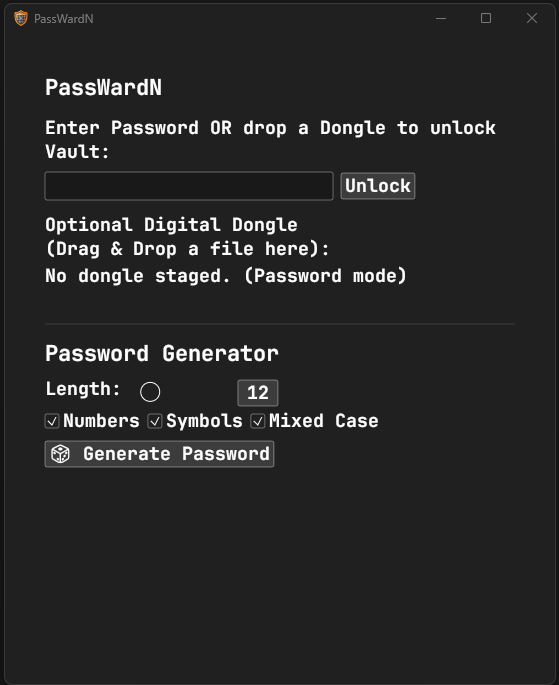
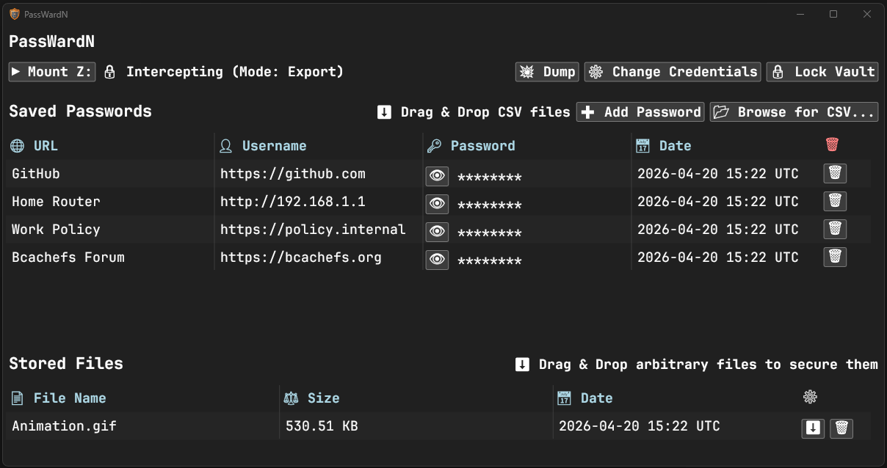
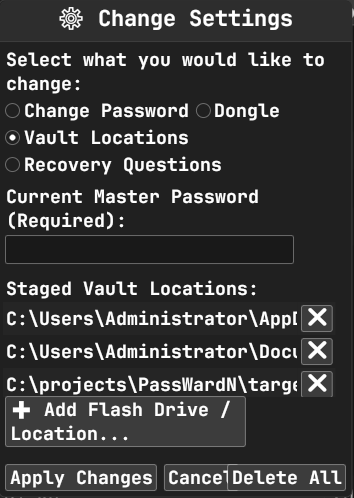

# PassWardN

PassWardN is a highly secure, redundancy-focused password and file vault built in Rust. It utilizes military-grade encryption, an innovative virtual drive ingestion system, and an automatic multi-drive synchronization grid to ensure your sensitive data is always safe, up-to-date, and accessible.





## Features

### 🔒 Military-Grade Cryptography
* **ChaCha20-Poly1305 Encryption:** Secures all stored passwords and files with high-speed, authenticated encryption.
* **Argon2 Key Derivation:** Hardens the master password against brute-force and dictionary attacks.
* **Zeroized Memory:** Automatically wipes plaintext passwords and cryptographic material from RAM immediately after use.

### 🔑 Multi-Factor Authentication (Digital Dongle)
* **What is it?** A Digital Dongle turns any ordinary file (a family photo, an MP3, a hidden text document) into a physical hardware token. PassWardN hashes the exact bit-for-bit contents of the file using ultra-fast BLAKE3 to derive a secondary, highly secure cryptographic key slot.
* **How to Use It:**
  * **Setup:** During the initial vault setup (or later via "Change Settings" -> "Dongle"), simply drag and drop your chosen file into the PassWardN window.
  * **Unlocking:** At the login screen, drag and drop that *exact* same file into the window to stage it, then click "Unlock" (or press Enter).
  * **True 2FA:** For ultimate security, keep your Digital Dongle file on a physical USB keychain. This requires both "something you know" (your Master Password) and "something you have" (the USB drive with the exact file) to access your data.
* **Flexible Unlock:** You can configure your vault to be unlocked using just a Master Password, just a Digital Dongle, or strictly requiring *both*!

### 🖧 The Redundancy Grid & Auto-Heal
* **Multi-Drive Sync:** Automatically synchronizes encrypted vault chunks across your Primary Drive (AppData), Backup Drive (Documents), and Portable Drives (USB).
* **Smart Consensus Loading:** On launch, the app scans all drives and loads the most up-to-date vault using a file-size majority vote.
* **Grid Degradation Auto-Heal:** If a flash drive is wiped, corrupted, or desynced, the app automatically detects the discrepancy and seamlessly rebuilds the missing vault in the background.

### 📥 Force Load & Vault Recovery
* **The Feature:** PassWardN allows you to manually override the Redundancy Grid's consensus by forcing the application to load a specific, detached vault file.
* **How to Use It:** At the login screen, simply drag and drop any vault file (e.g., `secure_vault.bin`) directly into the PassWardN window. The UI will morph to stage the specific file. Enter your Master Password or drop your Digital Dongle to decrypt it.
* **Disaster Recovery:** This feature acts as a powerful backup restoration tool. If you load an isolated backup vault and make any modifications inside the app, PassWardN will automatically repack and synchronize that data across your currently connected Redundancy Grid—instantly healing and replacing the grid with the restored backup.

### � Ghost Driver (Virtual Z:\ Mount)
* **The Problem:** Web browsers typically export passwords as unencrypted, plaintext `.csv` files. Saving these directly to your standard "Downloads" or "Documents" folder is highly insecure—even if you delete the file immediately, forensic tools or OS shadow copies can often recover the plaintext data from the physical disk.
* **The Solution:** The Ghost Driver bridges this security gap by creating an isolated, temporary "Clean Room" to intercept these files safely.
* **Virtual Drop Zone:** Dynamically mounts a native `Z:\` drive directly into the Windows file system. You can save your browser exports straight to this secure drive.
* **The Gobble (Auto-Ingestion):** A background filesystem watcher actively intercepts `.csv` files the moment they hit the `Z:\` drive.
* **Automatic Shredding:** Instantly parses and encrypts the intercepted passwords into the secure vault, then immediately shreds the plaintext file from the disk (overwriting it with `0xFF` zeroization) before unlinking it, preventing any forensic recovery.

### 📁 Secure File Storage
* **Massive Payload Support:** Drag and drop files of almost any size directly into the PassWardN UI.
* **Zero-RAM Footprint:** Uses a chunked File Index architecture to encrypt and stream massive files directly to disk without causing stack overflows or excessive RAM consumption.
* **Easy Extraction:** Select any secured file inside the vault and extract it safely back to your physical drives.

### 🕵️ Anti-Forensics & Decoys
* **Sparse Decoy Files:** Generates a massive 10GB fake vault file using Windows NTFS sparse files and random CSPRNG noise. Designed to misdirect adversaries or slow down ransomware operations.
* **Anti-Recovery Shredding:** Bypasses Windows Defender locks to securely zero-out temporary files before unlinking them from the file system.

### ⏱️ Idle Auto-Lock
* **Activity Monitoring:** Monitors mouse and keyboard activity to ensure the vault isn't left exposed.
* **Dynamic Timeout:** Automatically locks the vault and purges memory after 60 seconds of inactivity (extended to 120 seconds if the `Z:\` drive is actively mounted).

### 🖥️ Responsive UI
* **egui Framework:** Hardware-accelerated, dark-themed graphical interface.
* **Dynamic Scaling:** The window automatically resizes between the compact login prompt and the expanded dashboard upon successful decryption.
* **Table Builders:** Cleanly formats large lists of URLs, usernames, passwords, and file names with built-in copy-to-clipboard functionality and password masking/revealing.

## Usage

1. **Launch the Application:** Run `PassWardN.exe`.
2. **Initialize the Vault:** Set a Master Password and optionally select external USB drives to add to your Redundancy Grid.
3. **Force Load a Vault:** At the login screen, drag and drop any detached vault file directly into the window to forcefully load and decrypt it.
4. **Add Passwords:**
   * Drag and drop a CSV directly into the window.
   * Click "Mount Z:" to activate the Ghost Driver, then save CSV exports directly to `Z:\` from your browser.
5. **Add Files:** Drag and drop any file into the PassWardN window to encrypt it.
6. **Extract Data:** Use the "Dump" button to quickly extract all passwords or files to a secure directory, or extract individual files directly from the UI.

## 🚨 Emergency Extraction (Python)
## 🚨 Emergency Extraction (Standalone Executable)

PassWardN is completely self-contained and natively handles all vault decryption and data extraction directly through its graphical interface. **You do not need to use any external tools during normal operation.**

However, for absolute peace of mind, an independent `emergency_dump.py` script is included in the root of the source directory. This is a "break-glass" recovery tool. It guarantees that you can always recover your passwords and files using standard, widely available Python cryptography libraries, even if the PassWardN executable is ever lost, corrupted, or unavailable on a new machine.

**To use the emergency script:**
1. Install the required cryptographic dependencies:
### 1. Compile to a Standalone Executable (Highly Recommended)
For true portability, you can compile the Python script into a single, standalone Windows `.exe`. This allows you to run the emergency extractor on any computer without needing Python installed!
1. Double-click the `build_emergency_exe.bat` file included in the source folder.
2. It will automatically download the required libraries and compile the GUI application.
3. You will find the finished `emergency_dump.exe` inside the new `dist/` folder. Copy this `.exe` to your USB drive alongside your vault!
4. To extract data, just run `emergency_dump.exe`, drag and drop your vault into the window, and enter your master password.

### 2. Running from Source (Python)
If you prefer to run the raw Python script directly instead of compiling it:
1. Install the required dependencies:
```bash
pip install cryptography argon2-cffi tkinterdnd2
```
2. Run the script against your vault file:
```bash
python emergency_dump.py secure_vault.bin
```

## License

*Private / Proprietary*
